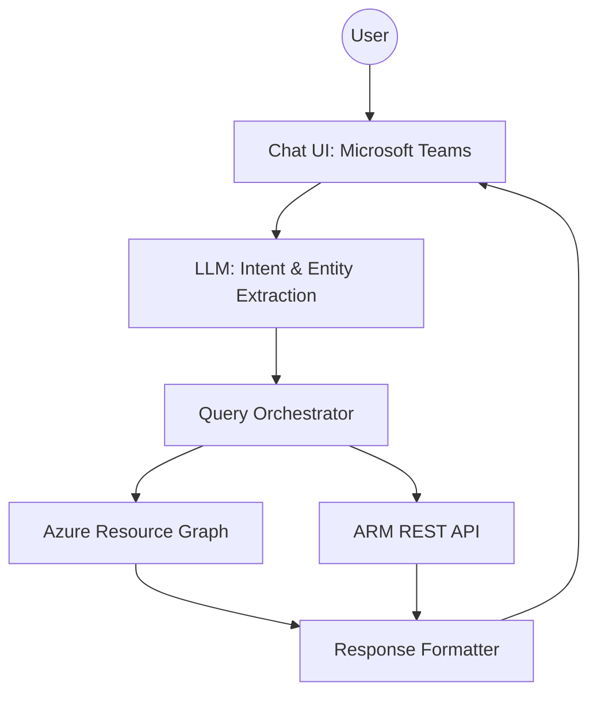
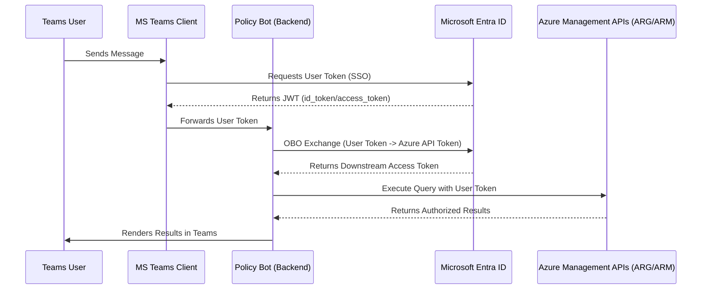

# Azure Policy Chat Bot - Consolidated Agent Specification

## Overview
This agent is an intelligent chat bot designed to answer governance and compliance questions by querying Azure Policy data. It is a **Microsoft Teams** application that leverages **Azure OpenAI** to translate natural language into technical queries, orchestrate data retrieval from multiple sources (Azure Resource Graph and ARM REST API), and deliver formatted, actionable responses.

## Architecture

The system follows a layered architecture with clear separation of concerns:

### Core Components

#### 1. Chat UI Layer
- **Platform**: Microsoft Teams (Adaptive Cards & Conversational UI).
- **Capabilities**: Rich formatting, interactive buttons, and deep links to the Azure Portal.

#### 2. LLM Layer (Intelligence)
- **Service**: Azure OpenAI Service (GPT-4).
- **Responsibilities**:
  - **Intent Detection**: Parsing user questions (compliance checks, exemption queries, resource details).
  - **Entity Extraction**: Identifying resource names, subscription IDs, and time ranges.
  - **KQL Translation**: Converting natural language into accurate Kusto Query Language (KQL) for Azure Resource Graph.
  - **Explanation**: Explaining *why* a resource is non-compliant based on policy definitions.

#### 3. Query Orchestrator
The central intelligence that routes requests to appropriate data sources:
- **Azure Resource Graph (ARG)**: Primary source for broad compliance queries, aggregations, and exemption listings across multiple subscriptions.
- **ARM REST API**: Used for deep detail queries, specific resource configurations, and fetching full policy definition metadata.

#### 4. Response Formatter
- **Logic**: Selects the best Adaptive Card template based on data type (lists, counts, or detailed resource views).
- **Citations**: Automatically includes references to specific Azure Policy Definition IDs or Assignment IDs.

## Authentication & Security (Zero Trust Architecture)

The bot is built on a **Zero Trust** foundation, ensuring that every request is explicitly authenticated and authorized using the user's own identity.

### 1. Identity & OAuth2 Flows
The bot implements the **On-Behalf-Of (OBO)** flow to ensure it never has standing permissions.

### 2. Zero Trust Principles in Practice
- **Explicit Verification**: Every query is performed using a token derived from the user's active session. The bot validates the `tid` (Tenant ID) and `aud` (Audience) of incoming tokens.
- **Least Privilege (User-Centric)**:
    - The bot has **zero** contributor/reader roles on Azure subscriptions.
    - If a user lacks `Microsoft.ResourceGraph/resources/read` permissions on a scope, the query returns an empty set.
    - **Scope Injection**: The orchestrator automatically appends scope filters (e.g., specific management groups) based on user context to prevent accidental broad queries.
- **Assume Breach (Infrastructure Security)**:
    - **Managed Identities**: Service-to-service communication (e.g., Bot to Key Vault or OpenAI) uses Managed Identities; no secrets are stored in code or environment variables.
    - **VNet Integration**: The Container App resides in a private VNet. External access is routed through a Web Application Firewall (WAF) or restricted Teams webhooks.
    - **Data Minimization**: The bot does not store query results or user compliance data. It acts as a stateless proxy between Teams and Azure.

### 3. Permission Scopes
The bot requires the following delegated permissions from the user:
- `user_impersonation`: To act on behalf of the user against the Azure Service Management API.
- `profile` / `openid`: For basic identity verification within Teams.

## Containerization & Infrastructure

### Container Strategy
- **Base Image**: `python:3.12-slim-bookworm` (security-hardened).
- **Hardening**: Non-root user execution, minimal system packages, and multi-stage builds.
- **Key Dependencies**: `botbuilder-core`, `azure-identity`, `azure-mgmt-resourcegraph`, `openai`.

### Azure Container Apps Deployment
- **Hosting**: Azure Container Apps (serverless, auto-scaling).
- **Scaling**: Scalling based on HTTP concurrency (min 1, max 10 replicas).
- **Security**: Managed Identity for service-to-service auth, VNet integration, and Key Vault for secret management.

## Key Features

1.  **Conversational Policy Intelligence**: Understands complex intents like "Show me all non-compliant storage accounts in my production subscription."
2.  **Intelligent Routing**: Automatically decides whether to query ARG for speed or ARM REST for depth.
3.  **Adaptive Cards**: Results are presented in rich, interactive cards with charts and deep links.
4.  **Graceful Degradation**: Falls back to alternative data sources if one is unavailable.

## Functions & Capabilities

- `DetectIntent(message)`: Uses LLM to determine user goal and extract parameters.
- `TranslateToKQL(intent)`: Generates optimized KQL queries for ARG.
- `OrchestrateQuery(intent, token)`: Executes the data retrieval strategy via OBO token.
- `RenderAdaptiveCard(data)`: Generates the JSON schema for Teams to display.

## Sample Interaction Scenarios

**Scenario 1: Compliance Check**
- **User**: "Why is 'app-server-01' non-compliant?"
- **Bot**: "The resource 'app-server-01' is non-compliant with the policy **'Linux machines should have Log Analytics agent installed'**. My analysis shows the agent is missing from this virtual machine."

**Scenario 2: Exemption Discovery**
- **User**: "Show me active exemptions for the Finance team."
- **Bot**: "I found 2 active exemptions in the 'Finance-Prod' subscription:
  1. **Exemption-001**: Waived 'Backup' policy until Dec 31 (Reason: Migration).
  2. **Exemption-002**: 'Allowed Locations' waiver for 'rg-temp'."

**Scenario 3: Deep Resource Details**
- **User**: "Get full configuration of storage account 'proddata001'."
- **Bot**: *[Returns Adaptive Card with full storage account configuration, including network rules and encryption settings fetched via ARM REST]*
