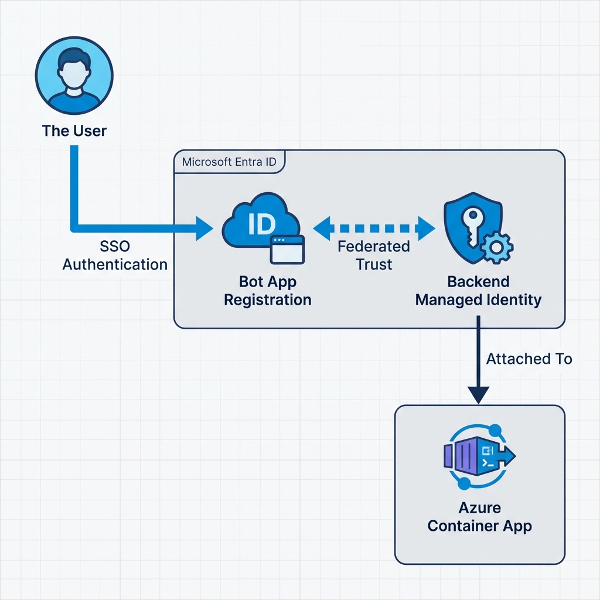

# Implementation Specification: Azure Policy Chat Bot

This document outlines the infrastructure, identity, and deployment requirements for the Azure Policy Chat Bot, following a **Zero-Secret** and **Federated Identity** model.

## 1. Prerequisites & Versioning

To ensure compatibility and security, use the following versions:

| Category | Requirement | Version |
| :--- | :--- | :--- |
| **Infrastructure** | Terraform | `~> 1.6.0` |
| | Azure RM Provider | `~> 3.90.0` |
| **Logic** | Python | `3.12-slim` |
| | Bot Framework SDK | `~> 4.15.0` |
| **CLI** | Azure CLI | `~> 2.56.0` |

## 2. Azure Regional Strategy

To comply with regional hosting requirements, all resources must be deployed within **US-based regions**. The deployment is further constrained by the availability of GPT-4o in Azure OpenAI.

> [!IMPORTANT]
> **Recommended Regions**: `eastus2` or `westcentralus`.
> These regions provide the best availability for GPT-4o and meet the "US-only" hosting mandate. Non-US regions (e.g., `swedencentral`) are strictly prohibited.

## 3. Required Azure Resources

| Resource | Service | Purpose |
| :--- | :--- | :--- |
| **Compute** | Azure Container Apps | Hosts the Python bot backend with User-Assigned Identity. |
| **Intelligence** | Azure OpenAI Service | Intent extraction and KQL generation (**GPT-4o** or **GPT-4 Turbo**). |
| **Security** | Azure Key Vault | Stores application configuration (No client secrets). |
| **Identity** | User-Assigned Managed Identity | Zero-secret identity for the Container App. |
| **Storage** | Azure Container Registry | Stores the bot's Docker images. |
| **Monitoring** | Application Insights | Logging, telemetry, and performance tracking. |

## 4. Federated Identity & Zero-Secret Strategy

This solution utilizes four distinct identities, each with a specific security boundary.

### A. Granular Identity Breakdown

| Identity | Type | Purpose | Key Functions | Essential Permissions |
| :--- | :--- | :--- | :--- | :--- |
| **Bot Backend Identity** | User-Assigned Managed Identity (UMI) | Represents the Container App. | Fetches configuration from Key Vault; authenticates to OpenAI; acts as the **Subject** for OBO federation. | `Key Vault Secrets User`, `Cognitive Services User`, `AcrPull`. |
| **Bot App Registration** | Entra ID App (Multi-tenant) | Teams "Passport". | Identity for the Bot Framework. Enables SSO in Teams. | `openid`, `profile`. |
| **API / OBO App Registration** | Entra ID App (Service Principal) | Token "Broker". | Exchanges Teams user tokens for Azure Management tokens via OBO flow. | `Azure Service Management (user_impersonation)`. |
| **ADO Deployer** | Service Principal (Federated) | Infrastructure "Builder". | Provisions Azure resources via Terraform. | `Owner` or `Contributor` + `User Access Administrator` (at RG scope). |

### B. Federated Trust Model (Zero-Secret)

Traditional client secrets are replaced by **Federated Credentials**, establishing trust between these identities without passwords:



1.  **Bot-to-Teams Trust**: The **Bot App Registration** is configured with a Federated Credential where the **Issuer** is `https://login.microsoftonline.com/{tenant_id}/v2.0` and the **Subject** is the Bot Backend UMI.
2.  **Deployment Trust**: The **ADO Deployer** uses OIDC (OpenID Connect). Azure DevOps generates a short-lived token that Azure Entra ID validates against the Federated Credential on the Service Principal.

### C. Managed Identity vs. Secrets
While **Federated Identity** eliminates the need for long-lived client secrets, Azure Key Vault remains a critical component for centralizing sensitive application configuration and external tokens.

| Secret Item | Source | Type | Purpose |
| :--- | :--- | :--- | :--- |
| `APPINSIGHTS_CONNECTION_STRING` | Terraform | Secret | Securely pass the monitoring key to the Container App. |
| `OPENAI_DEPLOYMENT_NAME` | Terraform | Secret | The specific deployment ID (e.g., `gpt-4o-deployment`). |
| `TEAMS_MANIFEST_ID` | Manual/App | Config | Centralized ID for the Teams application. |
| `EXTERNAL_API_KEYS` | Manual | Secret | Any future 3rd party integrations (e.g., ServiceNow). |

> [!NOTE]
> The `MICROSOFT_APP_PASSWORD` is **not required** in this architecture because we use Federated Credentials between the Bot App and the Managed Identity.

### C. API / OBO App Registration
- **Purpose**: Facilitates On-Behalf-Of (OBO) token exchange for Azure Graph/ARM.
- **Federation**: This app should also be configured with a Federated Credential trust for the Bot's Managed Identity.
- **Permissions**: `Azure Service Management (user_impersonation)`.

## 5. OpenAI Model Selection for KQL

Generating accurate Kusto Query Language (KQL) for Azure Resource Graph requires high reasoning capabilities and a large context window to process complex policy schemas.

| Model | Recommended Version | Strengths |
| :--- | :--- | :--- |
| **GPT-4o** | `2024-05-13` (or later) | **Primary Choice**. Superior speed and reasoning for KQL syntax. |
| **GPT-4 Turbo** | `2024-04-09` | High stability and large context window (128k) for multi-shot prompting. |

> [!TIP]
> **Prompting Strategy**: Provide the LLM with a schema snippet of `Microsoft.ResourceGraph/resources` to improve KQL accuracy for exotic resource types.

### D. Rationale: Why GPT-4o vs. GPT-5
While GPT-5 represents the next generation of AI, it is not recommended for this production governance bot for several reasons:
- **Production Stability**: GPT-4o is the current enterprise standard in Azure OpenAI, offering the best balance of reliability and performance.
- **KQL Proficiency**: GPT-4o is exceptionally optimized for structured query generation (KQL), minimizing syntax errors.
- **Regional Availability**: GPT-4o is readily available in the mandated US regions (`eastus2`), whereas next-gen models often face initial regional constraints.

## 6. Roles & Identities (Least Privilege)

The Bot backend has **zero** standing reader/contributor roles on subscriptions. All compliance data is fetched using the user's delegated identity.

### Managed Identity Roles (Bot Backend)
- `Key Vault Secrets User`: Required to fetch app configuration.
- `Cognitive Services User`: Required to call Azure OpenAI.
- `AcrPull`: For the Container App to pull its own image.

### User RBAC Requirements
- Users must have `Reader` permissions on the target subscriptions/resource groups to see compliance data.

## 7. Architecture Diagrams

### System Overview


### Authentication Flow (OBO)


## 8. Terraform Implementation Snippet (OIDC & Managed Identity)

```hcl
# Use Managed Identity for the Container App
resource "azurerm_user_assigned_identity" "bot" {
  name                = "id-policy-bot"
  location            = azurerm_resource_group.main.location
  resource_group_name = azurerm_resource_group.main.name
}

# Container App with zero secrets in ENV
resource "azurerm_container_app" "bot" {
  name                         = "ca-policy-bot"
  resource_group_name          = azurerm_resource_group.main.name
  container_app_environment_id = azurerm_container_app_environment.main.id
  revision_mode                = "Single"

  identity {
    type         = "UserAssigned"
    identity_ids = [azurerm_user_assigned_identity.bot.id]
  }

  template {
    container {
      name   = "bot-backend"
      image  = "botregistry.azurecr.io/policy-bot:latest"
      cpu    = 0.5
      memory = "1Gi"
      
      env {
        name  = "AZURE_CLIENT_ID"
        value = azurerm_user_assigned_identity.bot.client_id
      }
      env {
        name  = "AZURE_TENANT_ID"
        value = data.azurerm_client_config.current.tenant_id
      }
    }
  }
}
```
