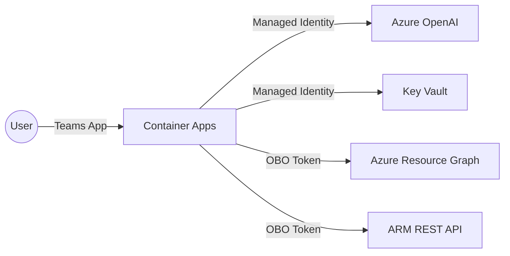
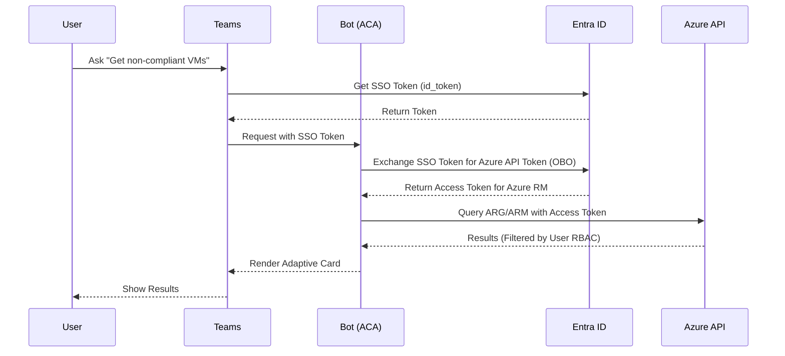

# Implementation Specification: Azure Policy Chat Bot

This document outlines the infrastructure, identity, and deployment requirements for the Azure Policy Chat Bot.

## 1. Prerequisites & Versioning

To ensure compatibility and security, use the following versions for development and deployment:

| Category | Requirement | Version |
| :--- | :--- | :--- |
| **Infrastructure** | Terraform | `~> 1.6.0` |
| | Azure RM Provider | `~> 3.90.0` |
| **Logic** | Python | `3.12-slim` |
| | Bot Framework SDK | `~> 4.15.0` |
| **CLI** | Azure CLI | `~> 2.56.0` |

## 2. Azure Regional Strategy

The bot's deployment is constrained by **Azure OpenAI** availability. For optimal performance and minimal latency, it is recommended to deploy all resources in a single region where OpenAI is available.

> [!IMPORTANT]
> **Recommended Region**: `swedencentral` or `eastus2`.
> Sweden Central offers superior availability for GPT-4 (including Turbo) and has a lower carbon footprint.

## 3. Required Azure Resources

| Resource | Service | Purpose |
| :--- | :--- | :--- |
| **Compute** | Azure Container Apps | Hosts the Python bot backend. |
| **Intelligence** | Azure OpenAI Service | Intent extraction and KQL generation. |
| **Security** | Azure Key Vault | Stores application secrets and Entra ID client secrets. |
| **Identity** | User-Assigned Managed Identity | Identity for the Container App to access Azure resources. |
| **Storage** | Azure Container Registry | Stores the bot's Docker images. |
| **Monitoring** | Application Insights | Logging, telemetry, and performance tracking. |

## 4. Entra ID Applications

The solution requires two primary Entra ID (formerly Azure AD) App Registrations to facilitate the Teams integration and the On-Behalf-Of (OBO) authentication flow.

### A. Bot Channel Registration App
- **Purpose**: Authenticates the bot with the Microsoft Bot Framework and Teams.
- **Key Settings**:
    - **Client ID**: Used as the `MicrosoftAppId`.
    - **Client Secret**: Stored in Key Vault.
    - **Redirect URIs**: Should point to `https://<your-app>.azurecontainerapps.io/api/auth-response`.

### B. API / OBO App Registration
- **Purpose**: Allows the bot to request access tokens for Azure Management APIs (ARG/ARM) on behalf of the signed-in Teams user.
- **Required Delegated Permissions**:
    - `Azure Service Management`: `user_impersonation`
    - `Microsoft Graph`: `User.Read`, `openid`, `profile`
- **Exposed API**: Must expose a scope (e.g., `access_as_user`).
- **Pre-authorized Clients**: Add Teams Mobile/Desktop IDs (`1fec8e78-bce4-4aaf-ab1b-5451cc387264`, `5e3ce6c0-2b1f-4285-8d4b-75ee78187346`).

## 5. Roles & Identities (Least Privilege)

Following the Zero Trust model, the Bot backend itself has **no standing permissions** to read Azure Policy data. All data access occurs via the user's delegated identity.

### Managed Identity Roles
The **User-Assigned Managed Identity** attached to the Container App requires:
- `Key Vault Secrets User`: To read secrets from Key Vault.
- `Cognitive Services User`: To call the Azure OpenAI API.
- `AcrPull`: To pull images from the Azure Container Registry.

### User RBAC Requirements
Users interacting with the bot in Teams must have at least:
- `Reader` (at the desired scope): To view policy assignments and resource data.
- `Resource Policy Contributor` (optional): If the bot is extended to allow creation/remediation.

## 6. Architecture Diagrams

### System Overview


### Authentication Flow (OBO)


## 7. Terraform Implementation Snippet

```hcl
# Container App with Identity
resource "azurerm_container_app" "bot" {
  name                         = "ca-policy-bot"
  resource_group_name          = azurerm_resource_group.main.name
  container_app_environment_id = azurerm_container_app_environment.main.id
  revision_mode                = "Single"

  identity {
    type         = "UserAssigned"
    identity_ids = [azurerm_user_assigned_identity.bot.id]
  }

  template {
    container {
      name   = "bot-backend"
      image  = "botregistry.azurecr.io/policy-bot:latest"
      cpu    = 0.5
      memory = "1Gi"
      
      env {
        name  = "AZURE_OPENAI_ENDPOINT"
        value = azurerm_cognitive_account.openai.endpoint
      }
    }
  }
}
```
